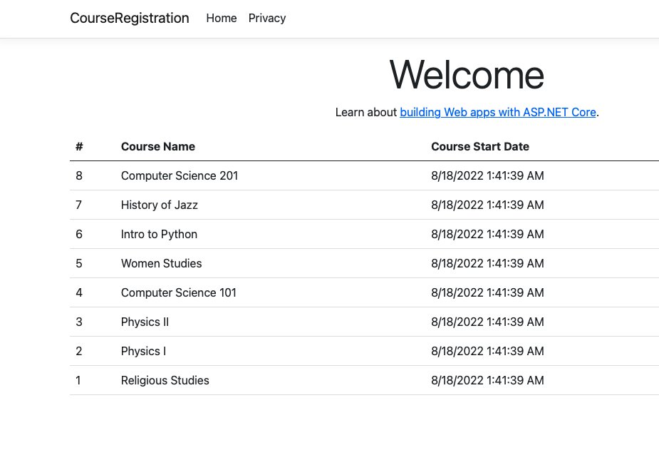

# QuickSort Section
This section is thankfully very easy when compared to a lot of possible algorithim bases projects because thank full many of the C# built in sorting algorithims use a variation of the Quick sort as their underlying algorithim. For our use case we will be working off the course registration project built for the [ReadOnly Project](src/DataStructures/Lists/ReadOnly/CourseRegistration).
You will see that we will implement a few changes between that project and this. So lets pretend that the requirements for our poject have changed and we need to order our courses by the most recent ones. We can achieve this quickly by using order by descending and pass in the id since that id is auto generated in sequence its perfect for getting us the most recent courses created.
```C#
using System;
using System.Collections.Immutable;
using CourseRegistration.Data;
using CourseRegistration.Models;
using Microsoft.EntityFrameworkCore;

namespace CourseRegistration.Repositories
{
    public class ReadCoursesRepository: IReadCoursesRepository
    {
        private readonly ApplicationDbContext _dbContext;
        public ReadCoursesRepository(ApplicationDbContext dbContext)
        {
            _dbContext = dbContext;
        }
        /// <summary>
        /// Returns a read only collection of the courses in descenging order by id.
        /// This is a great example of a "stable" quick sort as that is the underlying sort algorithim of the OrderBy
        /// </summary>
        /// <returns></returns>
        // https://stackoverflow.com/questions/5958769/what-sorting-algorithm-does-the-net-framework-implement
        // https://stackoverflow.com/questions/1832684/c-sharp-sort-and-orderby-comparison
        // https://docs.microsoft.com/en-us/dotnet/api/system.linq.enumerable.orderbydescending?view=net-6.0
        // https://www.tutorialsteacher.com/linq/linq-sorting-operators-orderby-orderbydescending
        public async Task<IReadOnlyCollection<Course>> GetCoursesNoTrackingAsync()
        {
            if (_dbContext.Courses is null)
            {
                return ImmutableList<Course>.Empty;
            }
            return await _dbContext.Courses
                .OrderByDescending(course => course.Id)
                .AsNoTracking()
                .ToListAsync();
        }
    }
}


```

