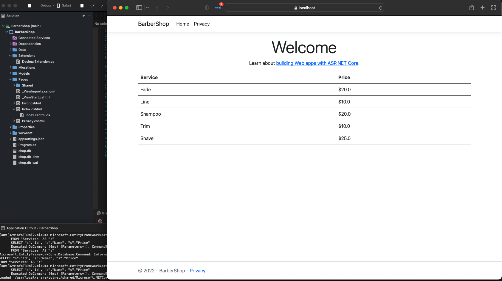

# Dictionary Section
In this section we will cover a very simple but over looked data structure and that a dictionary. This section will be quite small because a dictionary is very powerful but straight forward. Anytime you need a data structure that needs a fast look up of a simple or complex piece of data that has a simple identifier then Dictionary will win. In thise case I'm using a Dictionary to represent a barbershops pricing menu since the key in this case will be the service and the value will be the price. 

A few things to point out is that I'm taking advantage of the Linq and Ef Core to project data from my database into the Dictionary shape. I've also used the IDictionary interface to define the property on this model so that I can by default set the value to an ImmutableDictionary since it has a very optimized Empty property. **NOTE** this is an optimization for the sake of demostration and may not make sense in every use case but I added it as knowledge that these are things that can be done are valuable at all developer levels. Also take note of the use of the 
StringComparer.OrdinalIgnoreCase static class but do not confuse it with the StringComparison enum. They will provide the same functionality in most use cases but are neither the same data type and can't be used interchangably. Checking a methods definition to determine which one to use is a well advised approach.
```C#
using System.Collections;
using System.Collections.Generic;
using System.Collections.Immutable;
using BarberShop.Data;
using BarberShop.Models;
using Microsoft.AspNetCore.Mvc;
using Microsoft.AspNetCore.Mvc.RazorPages;
using Microsoft.EntityFrameworkCore;
namespace BarberShop.Pages;

public class IndexModel : PageModel
{
    private readonly ILogger<IndexModel> _logger;
    private readonly ShopDbContext _context;
    /// <summary>
    /// I've decided to use an IDictionary to show that any type that inherits from this interface could be used here
    /// for example by default this will be set to an Immutable dictionary of a string and decimal but it will be empty
    /// This is different than null in that a foreach operation can occur and not throw an exception but just won't loop since it's empty
    /// </summary>
    [BindProperty]
    public IDictionary<string, decimal> Menu { get; set; } = ImmutableDictionary<string, decimal>.Empty;

    public IndexModel(ILogger<IndexModel> logger, ShopDbContext context)
    {
        _logger = logger;
        _context = context;
    }
    /// <summary>
    /// This is a good example use for a dictionary since a menu or list of services is usually just that service and its price a key value pair
    /// </summary>
    /// <returns></returns>
    public IActionResult OnGet()
    {
        //Both of these below lines are purposefully redundant to display a few good practices and options
        // First if the context services is somehow null then its set to an empty collection of service that should allocate any memory but won't cause a null reference if someone misses if
        IEnumerable<Service> services = _context.Services ?? Enumerable.Empty<Service>();
        //Next if the services where somehow null or there was not anything in that collection we instantly return the page blank. This prevents the need for an else block since we just return if things go bad
        //We also log some warning messages since in our use case this should be something to raise alerts. 
        if(services is null || !services.Any())
        {
            string message = "No services where found";
            _logger.LogWarning("Warning: {message}", message);
            return Page();
        }
        //While it's not needed in this use case note the use of the stringcomparer not to be confused with the StringComparison enum
        // This helps when the string key might be of different casing
        Menu = services.ToDictionary(s => s.Name, s => s.Price, StringComparer.OrdinalIgnoreCase);
        return Page();
    }
}


```
