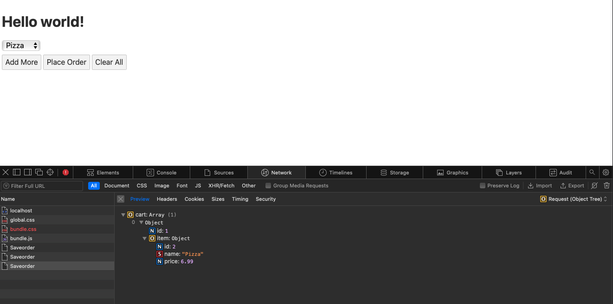
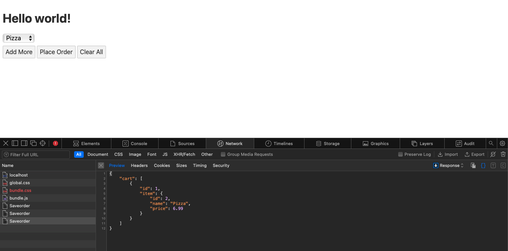

# IEnumerable Section
So I might be lying if I didn't admit this is going to most likely be the easier section to cover and for good reason. In C# you can put an IEnumerable anywhere and I meant anywhere.
The IEnumerable interface is a low level interface that other collections types inherit from. It's the core component of Linq as the vast majority of Linq functions are merely extensions on this interface meaning anything that inherits from it has the default ability to use Linq functions. It also has the ability to be transformed into any of its children classes in some way shape or form. What this means is that while it may not exaclty have the largest number of functions itself it is the most flexible and usable of the collections. I like to compare IEnumerable to Ditto from the Pokemon franchise. Sure you may want MewTwo (List) because it has a lot of default raw power but when compared against a foe that can literally transform into it and is far more flexible all that raw power can mean very little. 

The use case we are going to use in this example will be slighty different than the others as this example project will show off IEnumerable simplicity as the reasons of its strength. This project is broken up into two projects a Svelte based Javascript app for our front end and a C# minimal API as our backend. The purpose of this project is to provide an extremely simple and bare bones ordering system. The reason IEnumerable is perfect here is that the Svelte front end app will be sending a Javascript array of items to our back end API but our C# code doesn't need to do anything with that array other than lets say save that data. What this means is it's wasteful to use the higher level collections as we only need to absorb data and do nothing else with it. IEnumerable is perfect for that and in general is the perfect collection for working with data sent in from API requests.
### App.svelte
```Javascript
<script>
	let name = 'world';
	let CartItem = 1;
	let selected;
	let Cart =[];

	let items = [
		{id:1, name:'Burger', price: 12.99},
		{id:2, name:'Pizza', price: 6.99},
		{id:3, name:'Salad', price: 4.00},
	];
	let addItem = function(){
		CartItem++;
	};
	let clearItems = function(){
		CartItem =0;
	};
	let handSubmit = function(){
		submitOrder(Cart);
		console.log();
	};
	let addToCart = function(row, item){
		console.log({id:row,item:item})
		Cart.push({id:row,item:item});
	};

	async function submitOrder(cart){
		let result = await fetch("https://localhost:7278/Saveorder",{
			method: 'POST',
			headers: {
			'Accept': 'application/json',
			'Content-Type': 'application/json'
		},
			body: JSON.stringify({cart:cart})
		});
		let json = await result.json();
		console.log(json);
	};
</script>

<h1>Hello {name}!</h1>
<form>
	{#each Array(CartItem) as _, row}
	<div>
		<select bind:value={selected} on:change="{ () => addToCart(row, selected)}">
		{#each items as item}
		<option value={item}>
			{item.name}
		</option>
		{/each}
	</select>
	</div>
	
	{/each}
	
</form>
<button on:click={addItem}>
	 Add More
</button>
<button type=submit on:click={handSubmit}>
	Place Order
</button>
<button on:click={clearItems}>
	Clear All
</button>
```
### Program.cs
```C#
using System.Text.Json.Serialization;
using Microsoft.AspNetCore.Cors;

var builder = WebApplication.CreateBuilder(args);

// Add services to the container.
// Learn more about configuring Swagger/OpenAPI at https://aka.ms/aspnetcore/swashbuckle
builder.Services.AddCors( options =>
{
    options.AddPolicy( name: "AllowedUrls", builder =>
    {
        builder.WithOrigins("http://localhost:8080").AllowAnyMethod().AllowAnyHeader();
    });
});
builder.Services.AddEndpointsApiExplorer();
builder.Services.AddSwaggerGen();

var app = builder.Build();
app.UseCors("AllowedUrls");
// Configure the HTTP request pipeline.
if (app.Environment.IsDevelopment())
{
    app.UseSwagger();
    app.UseSwaggerUI();
}
app.UseDefaultFiles();
app.UseStaticFiles();
app.UseHttpsRedirection();

// https://docs.microsoft.com/en-us/aspnet/core/fundamentals/minimal-apis?view=aspnetcore-6.0
// https://docs.microsoft.com/en-us/aspnet/core/tutorials/web-api-javascript?view=aspnetcore-6.0
// https://nodogmablog.bryanhogan.net/2022/04/a-simple-cors-example-with-a-net-6-web-api-application-and-a-net-6-web-application/
app.MapPost("/Saveorder", [EnableCors("AllowedUrls")] (Cart cart) =>
{
    return Results.Created("/Order",cart);
});

app.Run();

record Cart()
{
    [JsonPropertyName("cart")]
    public IEnumerable<CartItem>? cart { get; init; }
}

record CartItem()
{
    [JsonPropertyName("id")]
    public int? id { get; init; }
    [JsonPropertyName("item")]
    public Item Item { get; init; }
}
record Item()
{
    [JsonPropertyName("id")]
    public int? Id { get; init; }
    [JsonPropertyName("name")]
    public string? Name { get; init; } = default!;
    [JsonPropertyName("price")]
    public decimal? Price { get; init; }
}

```
### Request

### Response
