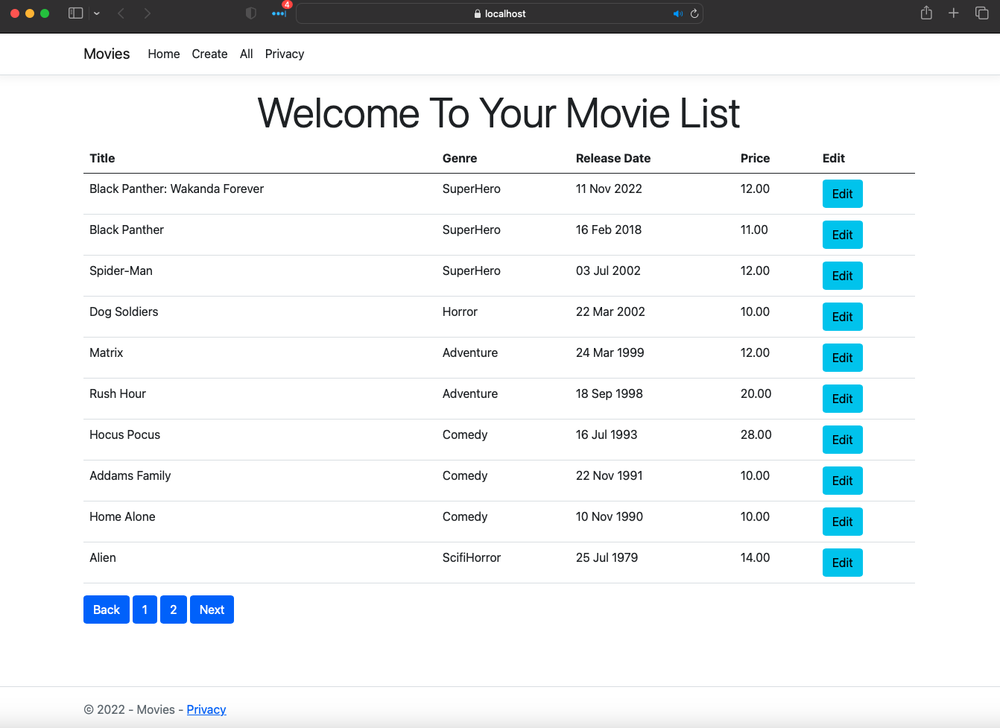
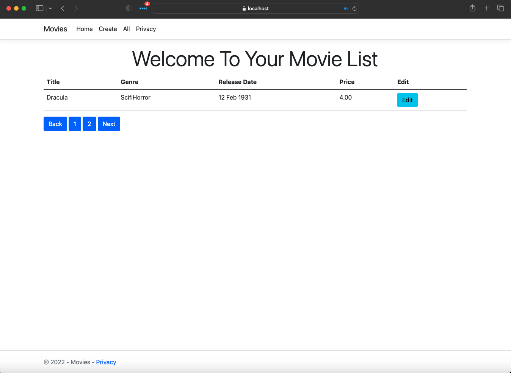

# IList Section

So its a fair bet that if your a C# developer of any level, beginner or senior you've likely used or at least have seen a C# List. The C# List is an extremely powerful and flexible class with many different uses. What many developers seem to ignore however is that the C# List class descends from the IList interface. C# developers often over use the List class when really it would make more sense to use IList interface. As with all interfaces any class or other type of interface that descends from it can be used to initialize variables or properties of the parent interface type. 

# Use Case
For our use case example we are going to be extending a [Movie Web App tutorial from Microsoft](https://learn.microsoft.com/en-us/aspnet/core/data/ef-rp/intro?view=aspnetcore-7.0&tabs=visual-studio). We are going to be providing the web app the ability to be paginated is a very similar way as the base tutorial but with a slight adjustment to benefit from IList.

Before we get into the code for those not familar Pagination is a term describing anything that can be broken up into multiple pages. Many modern websites support pagination especially when working with large collections of data as using pagination allows sites to limit the amount of data they need to render on a screen at any one given period of time. It also creates a wonderful user experience because users aren't bombarded with information on their screen all at once.

### PaginatedList
Below you are going to see code from created a custom class which will contain all our logic for building our Paginated List. The example code is based of [this section](https://learn.microsoft.com/en-us/aspnet/core/data/ef-rp/sort-filter-page?view=aspnetcore-7.0) of the above Microsoft tutorial with a few modifications made to it. I should clarify that this is only one way to create a Paginated list and there are many different ways to support that feature. For example here's an [article](https://www.mikesdotnetting.com/article/328/simple-paging-in-asp-net-core-razor-pages) provided by [Mike Brind](https://github.com/mikebrind) that shows a few different ways as well. You may notice that the final implementation in this article combines things from both approaches.

```C#
using System;
using Microsoft.EntityFrameworkCore;

namespace Movies.Features.Common
{
    #region Links
    // https://learn.microsoft.com/en-us/aspnet/core/data/ef-rp/sort-filter-page?view=aspnetcore-7.0
    // https://www.mikesdotnetting.com/article/328/simple-paging-in-asp-net-core-razor-pages
    #endregion
    public class PaginatedList<T>: List<T>
	{
		public int PagedIndex { get; private set; }
		public int Total { get; private set; }
		public PaginatedList()
		{
				
		}
		public PaginatedList(IEnumerable<T> items, int count, int pagedIndex, int size)
		{
			PagedIndex = pagedIndex;
			Total = (int)Math.Ceiling(count / (double)size);
			this.AddRange(items);
		}

		public bool HasPrevious => PagedIndex > 1;

		public bool HasNext => PagedIndex < Total;

        public static PaginatedList<T> Create(IEnumerable<T> input, int pageIndex, int pageSize)
        {
            IList<T>? source = input as IList<T>;
            if (source is null || source.Count == 0)
            {
                throw new InvalidOperationException("Paginated List Can not be created from null or empty collection");
            }

            int count = source.Count;
            IEnumerable<T> queryedItems = source.Skip((pageIndex - 1) * pageSize).Take(pageSize);
            return new PaginatedList<T>(queryedItems, count, pageIndex, pageSize);

        }

        public static async Task<PaginatedList<T>> CreateAsync(IEnumerable<T> input, int pageIndex, int pageSize)
		{
			IQueryable<T>? source = input as IQueryable<T>;
            if (source is null || !await source.AnyAsync())
			{
				throw new InvalidOperationException("Paginated List Can not be created from null or empty collection");
			}

			int count = await source.CountAsync();
			List<T> queryedItems = await source.Skip((pageIndex - 1) * pageSize).Take(pageSize).ToListAsync();
			return new PaginatedList<T>(queryedItems, count, pageIndex, pageSize);

		}
	}
}


```
### Index.cshtml.cs
```C#
using System.Collections.Immutable;
using Mediator;
using Microsoft.AspNetCore.Mvc;
using Microsoft.AspNetCore.Mvc.RazorPages;
using Microsoft.EntityFrameworkCore;
using Movies.Features;
using Movies.Features.Common;
using Movies.Features.Movies.Models;

namespace Movies.Pages;
// https://github.com/martinothamar/Mediator#32-handler-types
// https://www.youtube.com/watch?v=aaFLtcf8cO4
// https://github.com/martinothamar/Mediator
public class IndexModel : PageModel
{
    private readonly ILogger<IndexModel> _logger;
    private readonly IMediator _mediator;
    public IndexModel(ILogger<IndexModel> logger
        , IMediator mediator)
    {
        _logger = logger;
        _mediator = mediator;
    }
    public IList<Movie> Movies { get; set; } = ImmutableList<Movie>.Empty;
    [BindProperty(SupportsGet = true)]
    public int CurrentPage { get; set; } = 1;
    public int Count { get; private set; }
    public int PageSize { get; private set; } = 10;
    public int TotalPages { get; private set; }

    public async Task<IActionResult> OnGet()
    {
        var movies = await _mediator.Send(new GetAllMoviesQuery());
        if(movies is null || !movies.Any())
        {
            _logger.LogWarning("No Movies Found");
            return Page();
        }
        movies = movies.OrderByDescending(movie => movie.ReleaseDate).Take(PageSize);
        int countOfMovies = await movies.CountAsync();
        if (countOfMovies > PageSize)
        {
            var pagedList = await PaginatedList<Movie>.CreateAsync(movies, CurrentPage, PageSize);
            Movies = pagedList;
            TotalPages = pagedList.Total;
            return Page();
        }
        Movies = await movies.ToArrayAsync();
        return Page();
    }
}


```
In the above snippet you can see that for the IndexModel we have an IList so that I can set the collection to either be an array or a paginated list. Since the creation of the paginated list is more intensive than needed if the count of movies is less than the page size I don't even create it and instead convert the queryable into an array. I'm able to achieve this because both the Array class and the PaginatedList<T> inherit from the IList interface. This is an example of the flexibility the use of the IList interface affords me. 
Let me end this off by clarifiying this article is meant to be an example of what you CAN do and a reason you MAY want to use the IList interface. There are many other reasons to consider which data structure to use. I could easily have written that code to support a List instead and with a few changes everything will behave the same.
### Alternative Index.cshtml.cs using List instead of IList
```C#
using System.Collections.Immutable;
using Mediator;
using Microsoft.AspNetCore.Mvc;
using Microsoft.AspNetCore.Mvc.RazorPages;
using Microsoft.EntityFrameworkCore;
using Movies.Features;
using Movies.Features.Common;
using Movies.Features.Movies.Models;

namespace Movies.Pages;
// https://github.com/martinothamar/Mediator#32-handler-types
// https://www.youtube.com/watch?v=aaFLtcf8cO4
// https://github.com/martinothamar/Mediator
public class IndexModel : PageModel
{
    private readonly ILogger<IndexModel> _logger;
    private readonly IMediator _mediator;
    public IndexModel(ILogger<IndexModel> logger
        , IMediator mediator)
    {
        _logger = logger;
        _mediator = mediator;
    }
    public List<Movie> Movies { get; set; } = new List<Movie>();
    [BindProperty(SupportsGet = true)]
    public int CurrentPage { get; set; } = 1;
    public int Count { get; private set; }
    public int PageSize { get; private set; } = 10;
    public int TotalPages { get; private set; }

    public async Task<IActionResult> OnGet()
    {
        var movies = await _mediator.Send(new GetAllMoviesQuery());
        if(movies is null || !movies.Any())
        {
            _logger.LogWarning("No Movies Found");
            return Page();
        }
        movies = movies.OrderByDescending(movie => movie.ReleaseDate).Take(PageSize);
        int countOfMovies = await movies.CountAsync();
        if (countOfMovies > PageSize)
        {
            var pagedList = await PaginatedList<Movie>.CreateAsync(movies, CurrentPage, PageSize);
            Movies = pagedList;
            TotalPages = pagedList.Total;
            return Page();
        }
        Movies = await movies.ToListAsync();
        return Page();
    }
}


```

### Index.cshtml
And finally will have of Index.cshtml which will display our movies list as well as display the buttons to navigate the page.
```C#
@page
@model IndexModel
@{
    ViewData["Title"] = "Home page";
}

<div class="text-center">
    <h1 class="display-4">Welcome To Your Movie List</h1>
</div>

<div>
    <table class="table table-borded">
        <thead class="thead-dark">
            <tr>
                <th>Title</th>
                <th>Genre</th>
                <th>Release Date</th>
                <th>Price</th>
                <th>Edit</th>
            </tr>
        </thead>
        <tbody>
            @if (Model.Movies is not null && Model.Movies.Any())
            {
                foreach (var movie in Model.Movies)
                {
                    <tr>
                        <td>@movie.Title</td>
                        <td>@movie.Genre</td>
                        <td>@Html.DisplayFor(modelItem => movie.ReleaseDate)</td>
                        <td>@movie.Price</td>
                        <td><a input="submit" class="btn btn-info" asp-page="./Edit" asp-route-id="@movie.ID">Edit</a></td>
                    </tr>
                }

            }
        </tbody>
    </table>
    
    <div>
        <a asp-page="./Index" class="btn btn-primary" asp-route-currentPage="@(Model.CurrentPage - 1)">Back</a>
        @for(int indexOfPage = 1; indexOfPage <= Model.TotalPages; indexOfPage++)
        {
            <a asp-page="./Index" class="btn btn-primary" asp-route-currentPage="@indexOfPage">@indexOfPage</a>
        }
        <a asp-page="./Index" class="btn btn-primary" asp-route-currentPage="@(Model.CurrentPage + 1)">Next</a>
    </div>
    
</div>
```


