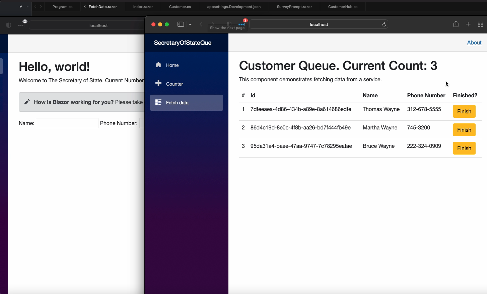

# List Section
This is a very complex section and that is indeed due to the fact that while the List class can be used in nearly every use case some of its more powerful abilities are only truly maximized in complex situations. For this project a Secretary of State Queue application has been built. 

Now based on the name you may wonder "why didn't he use a Queue here?". That is actually a great question and the reason for that is because while the Queue data structure is indeed a representation of what the idea of a queue is real world business that use a queue actually don't meet the needs of the pure queue concept.

In programming a queue is first in first out meaning anything that joins a queue joins the queue in a particular order and must leave the queue in the order it joined. There can be no accessing an individual item from a queue, which if you ever been at the Secretary of State , DMV or in a grocery store you'd know thats critical to their business. Each customer needs to be processed quickly to not back up the other customers and this means new lanes can be opened to handle customers more quickly.

Lucky for us we have List(actually IList but I'll get into that in a bit). Any class that inherits from the IList has the ability to access its data by index and has methods for adding and removing items on the fly which is exactly what we need in our feature set. 
Now since this project would provide a lot of value by dynamically refreshing when the data changes it has been built with Blazor and uses the SignalR library. Thanks to [Blazor and SignalR](https://docs.microsoft.com/en-us/aspnet/core/blazor/tutorials/signalr-blazor?view=aspnetcore-6.0&tabs=visual-studio-mac&pivots=server) I can build an application that will dynamically change and will be able to use our C# data types on the front end.
### Index.Razor
So the first C# file we will discuss in this section will be the INdex.Razor file which will contain all of ourindex logic and act as the main page that our customers of our Queue would interact with. 
```C#
@page "/"
@using Microsoft.AspNetCore.SignalR.Client
@using SecretaryOfStateQue.Models
@inject NavigationManager NavigationManager
@implements IAsyncDisposable
<PageTitle>Index</PageTitle>

<h1>Hello, world!</h1>

Welcome to The Secretary of State.

Current Number of Customers In Line : @CustomerCount

<SurveyPrompt Title="How is Blazor working for you?" />
<div class="form-group">
    <label>Name: <input @bind="customer.Name" /></label>
    <label>Phone Number: <input @bind="customer.Phone" /></label>
    <button class="btn btn-success" @onclick="JoinQueue">Join Queue</button>
</div>


@code {
    private HubConnection connection = default!;
    private Customer customer = new();
    private List<Customer> Customers = new List<Customer>();
    private int CustomerCount = 0;
    protected override async Task OnInitializedAsync()
    {
        connection = new HubConnectionBuilder()
        .WithUrl(NavigationManager.ToAbsoluteUri("/customerQue"))
        .Build();

        connection.On<Customer>("QueuedCustomer", (customer) =>
        {
            Customers.Add(customer);
            CustomerCount = Customers.Count;
            InvokeAsync(StateHasChanged);
        });

        await connection.StartAsync();
    }

    private async Task JoinQueue()
    {
        if (connection is null)
        {
            ArgumentNullException.ThrowIfNull(connection);
        }
        if (customer is not null && customer != default)
        {
            customer.PlaceInLine = CustomerCount + 1;
            CustomerCount = customer.PlaceInLine;
            await connection.SendAsync("SendMessageAsync", customer);
            customer = new();
        }

    }
    public async ValueTask DisposeAsync()
    {
        if (connection is not null)
        {
            await connection.DisposeAsync();
        }
    }
}


```
### FetchData.Razor
The next file is our FetchData.Razor file. This was originally create from the boiler plate template but for our needs I've adjusted it to now display the Customer List data to of SOS employees.
```C#
@page "/fetchdata"
@using Microsoft.AspNetCore.SignalR.Client
@using SecretaryOfStateQue.Models
@inject NavigationManager NavigationManager
@implements IAsyncDisposable
<PageTitle>Customer Queue</PageTitle>

@using SecretaryOfStateQue.Data
@inject WeatherForecastService ForecastService

<h1>Customer Queue. Current Count: @Customers.Count </h1>

<p>This component demonstrates fetching data from a service.</p>

@if (Customers == null || !Customers.Any())
{
    <p><em>Loading...</em></p>
}
else
{
    <table class="table">
        <thead>
            <tr>
                <th>#</th>
                <th>Id</th>
                <th>Name</th>
                <th>Phone Number</th>
                <th>Finished?</th>
            </tr>
        </thead>
        <tbody>
            @foreach (var customer in Customers)
            {
               
                <tr>
                    <td>@customer.PlaceInLine</td>
                    <td>@customer.Id</td>
                    <td>@customer.Name</td>
                    <td>@customer.Phone</td>
                    <td><button class="btn btn-warning" @onclick="() => FinishCustomer(customer)">Finish</button></td>
                </tr>
            }
        </tbody>
    </table>
}

@code {
    //So the main reason here we are using a list might not be as obvious as one might think
    //First of all while in the real world a queue is what is used in either the DMV of social security the software engineering queue is while very similiar doesn't compare to well
    //A real world queue is typically handled by multiple tellers or employees and handle customers out of order from when they joined the queue.
    //Also each customer may have issues or need services that take longer than one another. You may join the queue before someone else but finish after them.
    //In C# a List is a better data structure for that since it has functions that allow adding and removing from the list as well as accessing its elements individually
    //Now in this use case an IList can also be used over the List however here we are using the List versus the IList because a List is a bit faster to loop over
    // Here's a link to an article that benchmarks that very thing https://levelup.gitconnected.com/ilist-t-vs-list-t-performance-dad1688a374f
    // Here's another https://bytelanguage.net/2021/12/02/why-is-foreach-iteration-over-listt-faster-than-ilistt/
    // Now something to also keep in mind is that the general speed is so small in the real world is a very minor optimization meaning you are very likely not going to gain a lot from using List
    // Also any interface is likely to be preffered over a concrete implementation when writing code that other pieces of code may find value from
    // Below are a number of stack over flow articles I find valuable in thinking about which to use over the other
    // https://stackoverflow.com/questions/3628425/ienumerable-vs-list-what-to-use-how-do-they-work
    // https://stackoverflow.com/questions/23536541/performance-between-iterating-through-ienumerablet-and-listt


    private HubConnection connection = default!;

    private List<Customer> Customers = new List<Customer>();

    protected override async Task OnInitializedAsync()
    {
        connection = new HubConnectionBuilder()
        .WithUrl(NavigationManager.ToAbsoluteUri("/customerQue"))
        .Build();

        connection.On<Customer>("QueuedCustomer", (customer) =>
        {
            Customers.Add(customer);
            InvokeAsync(StateHasChanged);
        });

        await connection.StartAsync();
    }
    private async Task FinishCustomer(Customer customer)
    {
        Customers.Remove(customer);
        await InvokeAsync(StateHasChanged);
    }
    public async ValueTask DisposeAsync()
    {
        if (connection is not null)
        {
            await connection.DisposeAsync();
        }
    }
}


```
Ok now that you've seen main bits of code referencing our list I'm going to go over the final reason we've used a List over and IList and that's because of minor optimizations. This web app will be using blazor and signalR to constantly refresh the same list over and over again. Because of our feature set will will also be looping over that same list over and over again. A concrete class will already have memory allocated for it versus an interface when we enumerate meaning it is closer to an ideal state than its interface counter part. That being said these are minor optimizations while yes it is the ideal use case your app isn't going to likely suffer much if a List is used over and IList. Since the list we are creating is only be used by one code file it doesn't need to be very flexible so an IEnumerable or an IList won't gain us a whole lot. 
Here are some Links to help better explain that point.
[Link 1](https://levelup.gitconnected.com/ilist-t-vs-list-t-performance-dad1688a374f)
[Link 2](https://bytelanguage.net/2021/12/02/why-is-foreach-iteration-over-listt-faster-than-ilistt/)
[Link 3](https://stackoverflow.com/questions/3628425/ienumerable-vs-list-what-to-use-how-do-they-work)
[Link 4](https://stackoverflow.com/questions/23536541/performance-between-iterating-through-ienumerablet-and-listt)

