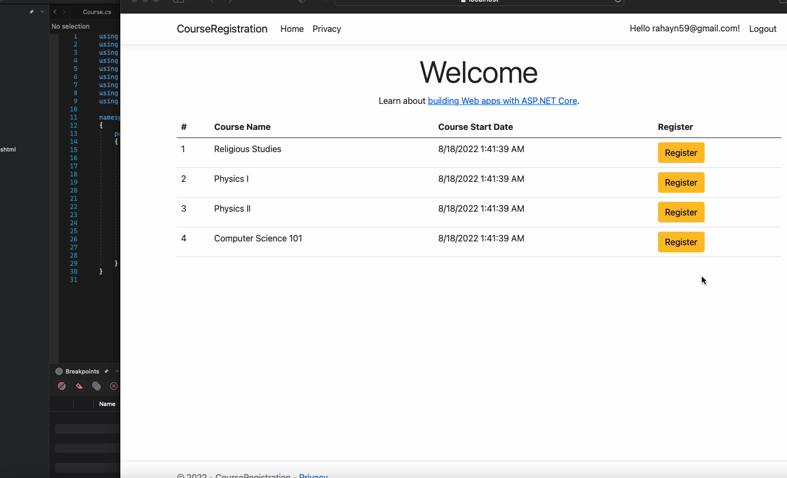

# ReadOnlyList Section
I will admit this was an interestiong sections to plan out and note due to any dificulty but rather it was more about clarity and intention of code when picking this data structure. So in C# there are a few versions of the collections made avaliable to us developers that are named readonly. What this means is that they are versions of other collections that often lack and Add() or Remove() function meaning they are to be used when the data is not expected to change. **Warning** it is not impossible to change their data they just do not provide functions intended for that purpose. The project we are going to be working with here is a course registration system.

This course registration system pulls it's data from database using EntityFramework Core. **NOTE** Do not confuse this with EntityFramework while they are named the same they are indeed not the same library and EntityFramework Core had APIs and improvements over EntityFramework. One such optimization EF core has is the AsNoTracking function.

Before I go to much further let me explain what the change tracker is. When EF core retrieves data from a database it loads that data into the change tracker. This allows developers to write code that will easily update individual records in their database. If a feature needs data but has no need to change that data then the change tracker can be bypassed using the AsNoTracking feature. 

Now with that out the way I should clarify that the IReadOnlyList was choosen for no other reason that it's name. To clarify the ef core query will still return a basic IEnumerable which doesn't have Add() or Remove() functions as apart of the interface. However the IEnumerable interface is the most flexible of the collection interfaces and is often times meant to contain the data and then let it be transformed into some other collection type. In this use case we don't want to change the data in anyway shape or form. In fact I've written a ReadOnly data repository class to confirm that this data shouldn't be changed and even made the AsNoTracking phrase apart of the functions name and summary comment plus returned a data type that explains it shouldn't be changed. 

In Summary this was interesting because the structure itself wasn't better or worse than any of the other structures I could have used in this example but I choose it because I have the intention that this data not be changed when this function is called and want this intention as clear as possible to prevent any potential mistakes by other developers. 

```C#
using System;
using System.Collections.Immutable;
using CourseRegistration.Data;
using CourseRegistration.Models;
using Microsoft.EntityFrameworkCore;

namespace CourseRegistration.Repositories
{
    public class ReadCoursesRepository: IReadCoursesRepository
    {
        private readonly ApplicationDbContext _dbContext;
        public ReadCoursesRepository(ApplicationDbContext dbContext)
        {
            _dbContext = dbContext;
        }

        public async Task<IReadOnlyList<Course>> GetCoursesNoTrackingAsync()
        {
            if (_dbContext.Courses is null)
            {
                return ImmutableList<Course>.Empty;
            }
            return await _dbContext.Courses.AsNoTracking().ToListAsync();
        }
    }
}


```
