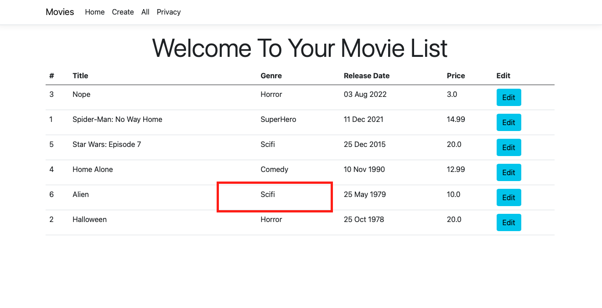
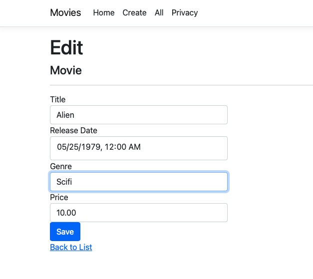
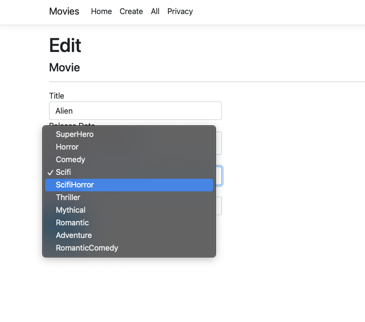
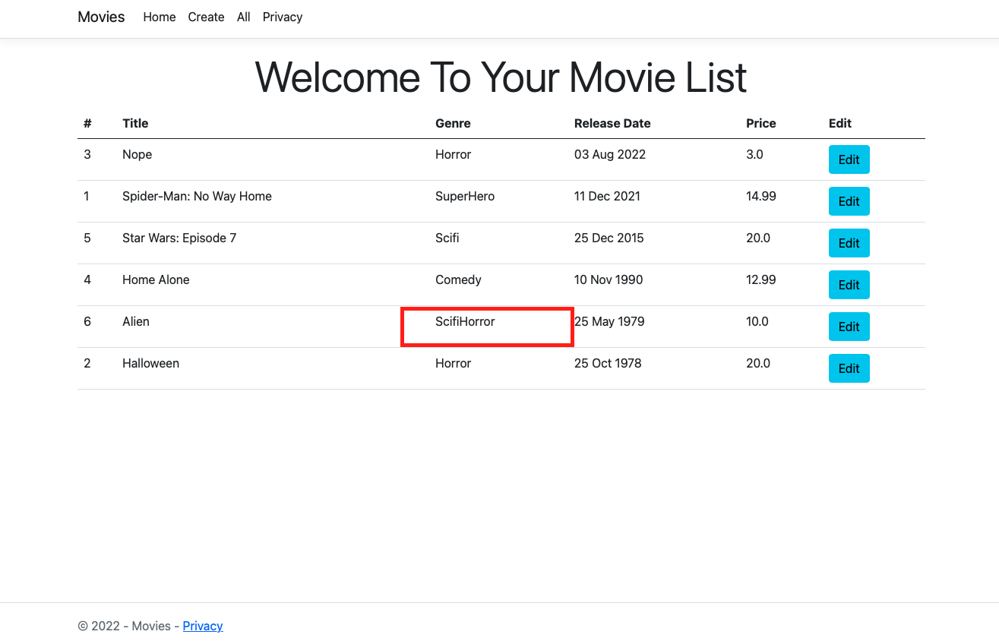

# Iqueryable Section
# Table of Contents
1. [Intro](#part-1--the-intro)
2. [Backstory](#part-2-the-backstory)
3. [Problem And Solution](#part-3-the-problem-and-solution)
4. [Code](#part-4-code-examples)
5. [Code](#part-5--screenshots)

## Part 1 : The Intro
So the [IQueryable](https://docs.microsoft.com/en-us/dotnet/api/system.linq.iqueryable-1?view=net-6.0) collection interface might be one of the strangest we will be discussing in this project. Many of the other data structures have pros and cons but their pros and cons are relevant to how they access and structure data. They IQueryable on the other had has it's potential maxmized when its combined with Linq functions in ways the others do not which we will go into next.

## Part 2: The backstory
Lets go over a few terms that will help us understand IQueryable, "enumerate" and "deferred execution". The verb enumerate is used to describe iterating over a collection and reserving some amount of memory for that collection. This often occurs when certain functions on an IEnumerable are called like ToList(), Count(), Select, Etc. Next we have deferred execution which can be described as functionality that executes only during the enumeration process. The [Where](https://docs.microsoft.com/en-us/dotnet/api/system.linq.enumerable.where?view=net-6.0) function in Linq works in this manner because any filtering you apply on a data set only takes place onces its been enumerated. 

```C#
// Believe it or not the where clause is not being activated in this line of code because nothing has yet triggered the query execution.
IEnumerable<Car> OldCars = Cars.Where(car => car.ModelDate > DateTime.Today);
return OldCars;
```
```C#
// The where clause here however is activated here but its actually activated on line 15 because turning the data into a List type will reserve memory and cause our query to enumerate
IEnumerable<Car> OldCars = Cars.Where(car => car.ModelDate > DateTime.Today);
return OldCars.ToList();
```
The IQueryable is a child of IEnumerable that is specifically meant to use deferred execution to chain Linq statements together to build database queries. When C# developers combine Linq statements with other data structures the code may still result in the output they intend, but that code may return more data in memory than needed to get that work done. For example lets say I have a function that returns a list cars but calls an ef core db context to do so, it might trigger a query that returns back 1000 rows of data into memory. That itself might not be bad, but lets also pretend I have some code that calls that function but it is actually only intended to get one car back.
```C#
public List<Car> GetAllCars()
{
    return dbcontext.Cars.ToList();
}

var myCar = GetAllCars.FirstOrDefault(car => car.UserId == myuserid);
```
This could result is a sql query that might look something like the below
```SQL
SELECT name, model, userid 
FROM Cars
```

Now this sql is really poor when we take into consideration we really only want to get one car. Here's where IQueryable can save us.

```C#
public IQueryable<Car> GetAllCars()
{
    return dbcontext.Cars;
}

var myCar = await GetAllCars.FirstOrDefaultAsync(car => car.UserId == myuserid);
```
Because of the IQueryable data type C# will build a query that looks more like the below statement because the Linq functions have been chained together before being executed against the database, giving our code more accurate instructions for building our query.
```SQL
SELECT top 1 name, model, userid 
FROM Cars Where userid == @p1
```
So with those concepts out of the way will next go into two other concepts that when combined together can give our IQueryable a really powerful use case. Those are the [CQRS](https://docs.microsoft.com/en-us/azure/architecture/patterns/cqrs) architecture pattern and the [Mediator](https://dotnetcoretutorials.com/2019/04/30/the-mediator-pattern-in-net-core-part-1-whats-a-mediator/) gang of four design pattern.

### CQRS
CQRS stands for Command Query Responsibility Segregation. In short is a pattern for writting classes who are meant to represent a database query to gather data and commands which are database statements for changing or creating data. Each query and command also often (but maybe not always) gets its own handler class meant to handle the execution of that command and/or query. It's an very popular and common pattern because it makes it very very clear what the jobs of some classes are versus others. It has a massive draw back however in that it generally can result in applications dramatically increasing in code file size. This is due to the fact that as developers when we build sql queries and update statements we are often very specific in the data we want returned or updated per our use case. 
### Mediator
Next we have mediator which is a design pattern around making classes who act as mediators between other classes. It allows for some classes to only know how to work with results from calling another class but not needing to know details of how to do the work. In C# we even have a very popular nuget package named [MediatR](https://github.com/jbogard/MediatR) for helping devlopers implement the pattern easily.

Hopefully you now have enough information to know that these 2 concepts blend very well with one another and many C# developers view them as one and the same. Even though they are different concepts you will often see developers use Mediatr to implement the CQRS pattern. 

To save time I've taken one of Microsofts tutorials around creating a [web applications about movies](https://docs.microsoft.com/en-us/aspnet/core/tutorials/razor-pages/razor-pages-start?view=aspnetcore-6.0&tabs=visual-studio-mac) and we are going to make some adjustments that combine CQRS, MediatR and the Iquerayble data structure to write some more organized and enterprise grade level software.

## Part 3: The problem and solution
So to help paint a picture on why we are doing this I'm going to create a problem statement and a solution. I believe this will explain that many software concepts only make sense when we have problems to solve and only make sense when they are used in combination with some other concept.

### Problem Statement: 
```
"Our latest movie list application doesn't meet the archiecture standards that our Software Architect team agreed on and we need an emergency refactor so it's line with the rest of the applications. The reason for this because we want all teams to be able to easily work on any app at any time so they have guidelines they must follow. The most critical of these is they all follow the CQRS pattern. The team working on this however didn't follow that pattern because they didn't want too many code files."
```
### A Solution: 
```
"Lets use MediatR and have the query handlers return IQueryable. This will allow us to follow the company guidlines but allow us to chain together our Linq statements so that we can keep the number of command and query class files small. Lets also start with the Edit page since it's not in prod yet." 
```
## Part 4: Code Examples

## Previous Edit.cshtml.cs
```C#
public class EditModel : PageModel
{
    private readonly RazorPagesMovie.Data.RazorPagesMovieContext _context;

    public EditModel(RazorPagesMovie.Data.RazorPagesMovieContext context)
    {
        _context = context;
    }

    [BindProperty]
    public Movie Movie { get; set; } = default!;

    public async Task<IActionResult> OnGetAsync(int? id)
    {
        if (id == null || _context.Movie == null)
        {
            return NotFound();
        }

        var movie =  await _context.Movie.FirstOrDefaultAsync(m => m.ID == id);
        if (movie == null)
        {
            return NotFound();
        }
        Movie = movie;
        return Page();
    }

    // To protect from overposting attacks, enable the specific properties you want to bind to.
    // For more details, see https://aka.ms/RazorPagesCRUD.
    public async Task<IActionResult> OnPostAsync()
    {
        if (!ModelState.IsValid)
        {
            return Page();
        }

        _context.Attach(Movie).State = EntityState.Modified;

        try
        {
            await _context.SaveChangesAsync();
        }
        catch (DbUpdateConcurrencyException)
        {
            if (!MovieExists(Movie.ID))
            {
                return NotFound();
            }
            else
            {
                throw;
            }
        }

        return RedirectToPage("./Index");
    }

    private bool MovieExists(int id)
    {
      return (_context.Movie?.Any(e => e.ID == id)).GetValueOrDefault();
    }
```
Now lets begin modifying this class so we can take advantage of the power of IQuerayble, CQRS and MediatR

First we will need a Command class to act as our update statement
```C#
public record ModifyMovieCommand(Movie movie): IRequest<Movie>;
```
Once thats done we can go ahead and add our CommandHandler class.
```C#
public class ModifyMovieCommandHandler : IRequestHandler<ModifyMovieCommand, Movie>
{
    private readonly MovieDbContext _context;
    public ModifyMovieCommandHandler(MovieDbContext context)
    {
        _context = context ?? throw new ArgumentNullException(nameof(context));
    }

    public async Task<Movie> Handle(ModifyMovieCommand request, CancellationToken cancellationToken)
    {
        _context.Attach(request.movie).State = EntityState.Modified;
        int saved = await _context.SaveChangesAsync(cancellationToken);
        if (saved is not 1)
        {
            throw new InvalidOperationException("Save Changes Failed");
        }
        return request.movie;
    }
}
```
Our final step will be to adjust our Program.cs file to reference MediatR in the dependency injection container
```C#
var builder = WebApplication.CreateBuilder(args);

// Add services to the container.
builder.Services.AddRazorPages();
builder.Services.AddMediatR(Assembly.GetExecutingAssembly());
builder.Services.AddDbContext<MovieDbContext>( options => options.UseSqlite(builder.Configuration.GetConnectionString("MovieDb")));
var app = builder.Build();

// Configure the HTTP request pipeline.
if (!app.Environment.IsDevelopment())
{
    app.UseExceptionHandler("/Error");
    // The default HSTS value is 30 days. You may want to change this for production scenarios, see https://aka.ms/aspnetcore-hsts.
    app.UseHsts();
}

app.UseHttpsRedirection();
app.UseStaticFiles();

app.UseRouting();

app.UseAuthorization();

app.MapRazorPages();

app.Run();

```

With all of those steps taken care of we can go ahead and modify our Edit class to look like the file below.
Modified Edit.cshtml.cs
```C#
public class EditModel : PageModel
{
    private readonly IMediator _mediator;

    public EditModel(IMediator mediator)
    {
        _mediator = mediator;
    }

    [BindProperty]
    public Movie Movie { get; set; } = default!;

    public async Task<IActionResult> OnGetAsync(int? id)
    {
        var movies = await _mediator.Send(new GetAllMoviesQuery());
        if (id == null || !movies.Any())
        {
            return NotFound();
        }

        var movie =  await movies.FirstOrDefaultAsync(m => m.ID == id);
        if (movie == null)
        {
            return NotFound();
        }
        Movie = movie;
        return Page();
    }

    // To protect from overposting attacks, enable the specific properties you want to bind to.
    // For more details, see https://aka.ms/RazorPagesCRUD.
    public async Task<IActionResult> OnPostAsync()
    {
        if (!ModelState.IsValid)
        {
            return Page();
        }

        try
        {
            var result = await _mediator.Send(new ModifyMovieCommand(Movie));
        }
        catch (DbUpdateConcurrencyException)
        {
            if (!await MovieExists(Movie.ID))
            {
                return NotFound();
            }
            else
            {
                throw;
            }
        }

        return RedirectToPage("./Index");
    }

    private async Task<bool> MovieExists(int id)
    {
        var movies = await _mediator.Send(new GetAllMoviesQuery());
        return (movies?.Any(e => e.ID == id)).GetValueOrDefault();
    }
}
```
## Part 5 : Screenshots
### Before

### Edit

### Selected

### Edited
