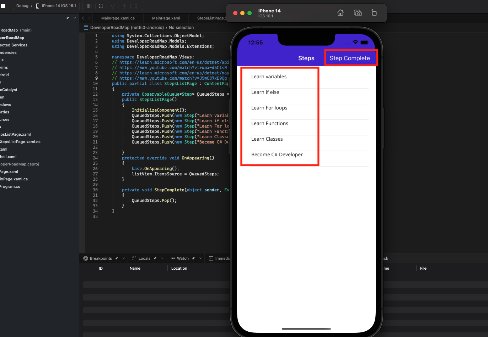
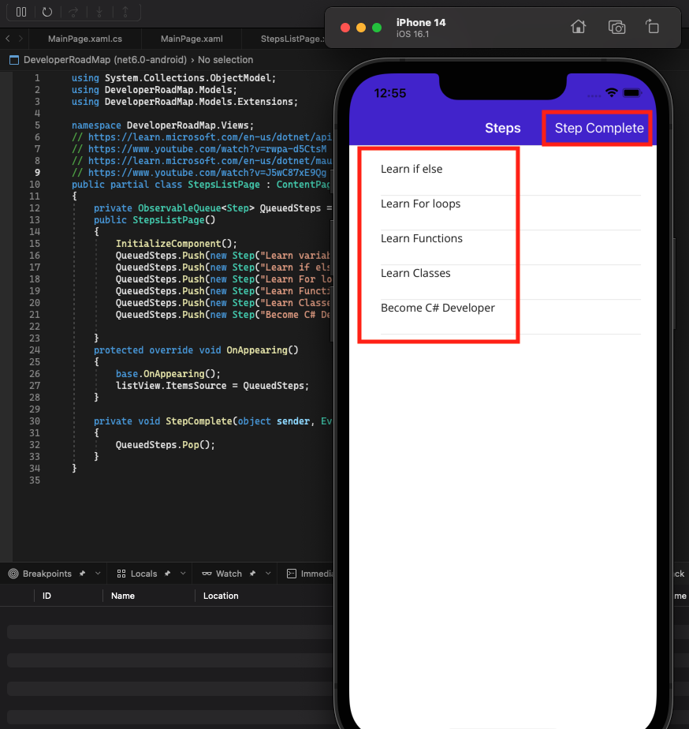
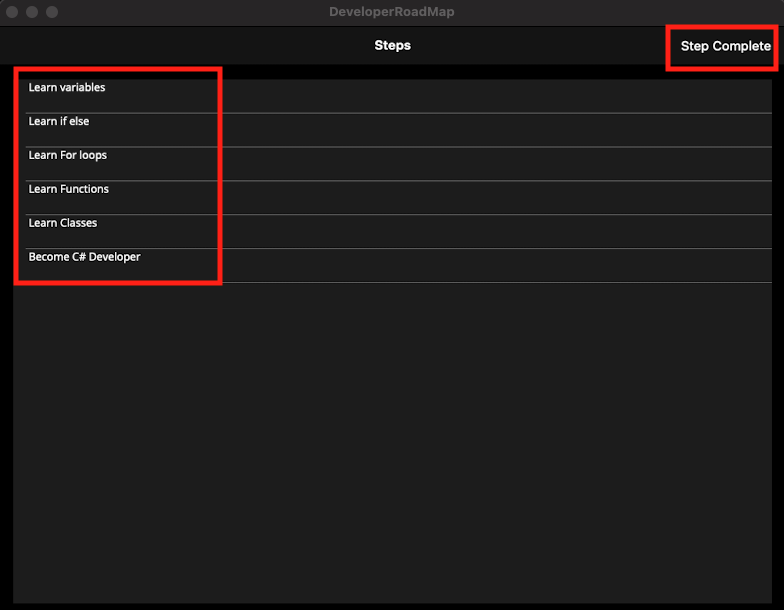

# Queue Section
For this section as well as the Stack section we are going to be cheating a slight bit when we discuss the target data structure. For most other sections we will be discussing the C# language provided implementations of a specific data structure of a Microsoft extension. For this and the Stack sections our targeted use case does benefit from the behavor of what a Queue should be but has a few more technical limitations that required a custom version of the Queue.

# Use Case
For this project we are going to build a Developer Road Map. Developer Road Map's are come in different forms (articles, presentations,charts, etc). They are typically used as guide for novice programmers to learn certain skills and techniques. The value of a Developer road map is try to to ensure that a new programmer doesn't overwhelm themselves by trying to learn several concepts all at once but instead tries to have them learn concepts one at a time. For example here is a great [ASP.NET Core Developer Roadmap for 2022](https://roadmap.sh/aspnet-core) Because of this nature, a roadmap is made up of steps that ideally are cleared one at a time, a Queue is a very good data structure to use to represent this in code. 

The reason for that is that a Queue's elements can't be removed by index. They must be removed in the order they where added since Queues follow First In First Out. The reason for some technical limitations is that our use case is going to be under the impression we are developers build a mobile version of a Developer Road Map. The idea being that we would like a Todo List like way for a young developer to clear the steps they deem to have completed whenever or whereever they are. Since were are going to be building a mobile app to achieve our goals we are going to be using .NET MAUI which build cross platform XAML based user interfaces. For a XAML UI to detect changes to a collection we need to use the ObservableCollection class. We could technicall use a different collection type but changes to our collection would not trigger a refresh of our user interface which we will need.

To support both our goals this project contains a customer class called ObservableQueue<T> which inherits from an ObservableCollection<T>. For those not familar with generics the T is like a placeholder to say this can be a collection of anything.

```C#
using System;
using System.Collections.ObjectModel;

namespace DeveloperRoadMap.Models.Extensions
{
    public class ObservableQueue<T>: ObservableCollection<T>
    {
        public ObservableQueue(): base()
        {
        }

        public void Push(T item)
        {
            base.Add(item);
        }
        public void Pop()
        {
            base.RemoveAt(0);
        }
    }
}


```

In the above code snippet you can see the ObservableQueue only implements 2 methods a Push which will just rely on the base ObservableCollections Add methods and a Pop which will rely on the base RemoveAt method and has a harded coded 0 meaning it will always remove the first element in that list at the time the method is called. This will allow for us to write code like what you will see below.

```C#
using System.Collections.ObjectModel;
using DeveloperRoadMap.Models;
using DeveloperRoadMap.Models.Extensions;

namespace DeveloperRoadMap.Views;
// https://learn.microsoft.com/en-us/dotnet/api/system.collections.stack?view=net-6.0
// https://www.youtube.com/watch?v=rwpa-d5CtsM
// https://learn.microsoft.com/en-us/dotnet/maui/ios/cli
// https://www.youtube.com/watch?v=J5wC87xE9Qg
public partial class StepsListPage : ContentPage
{
	private ObservableQueue<Step> QueuedSteps = new ObservableQueue<Step>();
	public StepsListPage()
	{
		InitializeComponent();
		QueuedSteps.Push(new Step("Learn variables"));
        QueuedSteps.Push(new Step("Learn if else"));
		QueuedSteps.Push(new Step("Learn For loops"));
        QueuedSteps.Push(new Step("Learn Functions"));
		QueuedSteps.Push(new Step("Learn Classes"));
		QueuedSteps.Push(new Step("Become C# Developer"));

	}
    protected override void OnAppearing()
    {
        base.OnAppearing();
		listView.ItemsSource = QueuedSteps;
    }

	private void StepComplete(object sender, EventArgs e)
    {
		QueuedSteps.Pop();
    }
}

```
The above snippet will build an ObservableQueue of a class called Step and in the Page constructor add steps to the Queue. There is also a method called StepComplete which will call our Queue's Pop method and remove items from our list.

## iOS Mobile App Images



## Mac Desktop App Images

