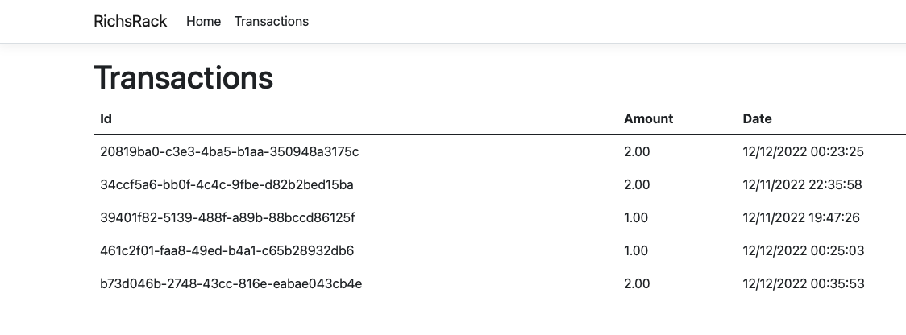
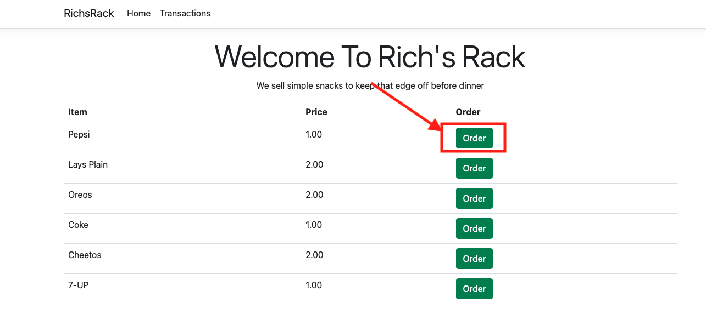
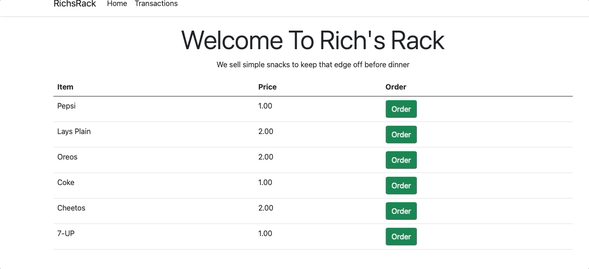

# Span Section
Ok even if you've been in the C# space for a while this data structure is very likely among the ones anyone has used and honestly in my opinion once you find out about it your going to regret not usng it and that is, the Span. I'll take spare my readers some time and avoid the technical details of what a Span is. There is a lot of content on the internet that explains the technical details of a Span in depth such as [this one](https://code-maze.com/csharp-span-to-improve-application-performance/) or [this one](https://learn.microsoft.com/en-us/archive/msdn-magazine/2018/january/csharp-all-about-span-exploring-a-new-net-mainstay) or [this one](https://nishanc.medium.com/an-introduction-to-writing-high-performance-c-using-span-t-struct-b859862a84e4) or even these videos 
[video 1](https://www.youtube.com/watch?v=jUZ3VKFyB-A&t=677s),[video 2](https://www.youtube.com/watch?v=sNf8IcdYtHY), [video 3](https://www.youtube.com/watch?v=mbLIplmHzdk), [video 4](https://www.youtube.com/watch?v=8d0PlpQm10w)(disclaimer this is in German). In short a span is a super fast Struct, emphasis on super fast which has no memory allocation and is on the stack versus the heap so there is no need for any garbage collection.
## Use Case
So as always lets discuss a use case for a Span. Lets imagine we are building an Online Snack shop that is has become extremly popular, more popular that expected and we've been hired as developer to help improve performance on a page that displays all the transactions of the snack shop. Our team has taken weeks and discussed a number of options to improve performance across the board. The team has decided to create a stored procedure on the database so the execution plan can be optimized, we've implemented a redis cache to store the transactions which will either expire every 30 minutes or when a new transaction has been created. Your task on the team is to now implement a Span on the page that shows the transactions since we are trying to get every ounce of speed we can. 
### Transactions.cshtml
```C#
@page
@model RichsRack.Pages.TransactionsModel
@using RichsRack.Features.Transactions
@using System.Runtime.InteropServices
@{
    ViewData["Title"] = "Transactions";
}

<h1>Transactions</h1>

@section Scripts {
    @{await Html.RenderPartialAsync("_ValidationScriptsPartial");}
}
<table class="table">
    <thead>
        <tr>
            <th>Id</th>
            <th>Amount</th>
            <th>Date</th>
        </tr>

    </thead>
    <tbody>

        @{
            //https://www.youtube.com/watch?v=jUZ3VKFyB-A
            // https://stackoverflow.com/questions/57229123/how-to-use-spanbyte-in-async-method
            // This is the first time in my life a local function felt like the thing to do :) 
            void BuildTransactionTable(List<Transaction> transactions)
            {
                Span<Transaction> allTransactions = CollectionsMarshal.AsSpan(transactions);

                @foreach (var item in allTransactions)
                {
                    <tr>
                        <td>@item.Id</td>
                        <td>@item.Amount</td>
                        <td>@item.TransactionDate</td>
                    </tr>
                }

            }
        }
        @{ BuildTransactionTable(Model.Transactions.ToList());}
    </tbody>

</table>
```
So after learning some of the strengths and weaknesses of of a Span you build the above local function in your Transaction razor page since a Span can't be directly defined in an async function or a lambda. 
## Pros
* VERY FAST! Nuff Said
## Cons
* Collection Should not be mutated. 
* Can't be used directly in an async function. A local function can be used a work around for this problem.
* Needs an Array or List in the constructor






